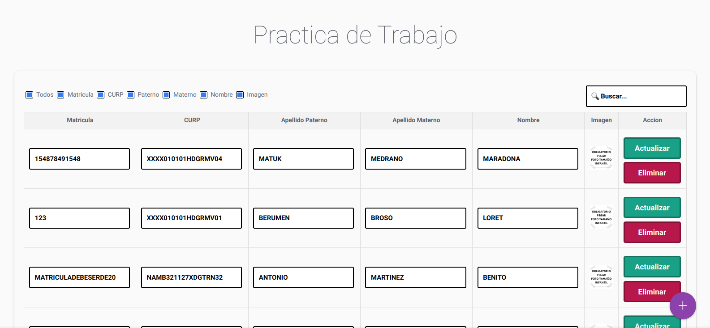
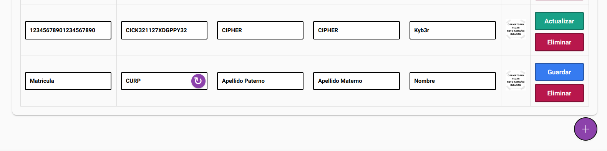
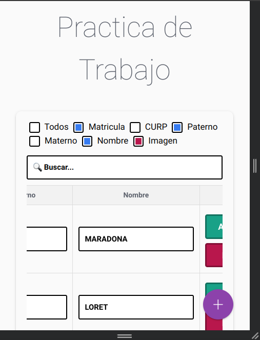
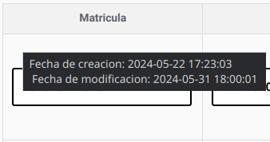
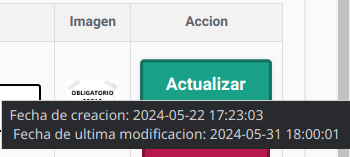

# Escolares Trabajo Practica
Se que pude usar PHP o PostMan para usar la API (como viene en la documentacion). Pero decidi irme a la basico y usar solo HTML, CSS y JS ya que el backend lo hacia la API. La pagina es responsive y genera la CURP con el boton ignorando la fecha de nacimiento y poniendo un estado por default, tambien en las validaciones valida que la curp sea valida y pues lo basico de que no haya campos vacios y los caracteres minimos pedidos.

### Screenshoots:

Reponsive: 

 Hover: 
Cuando se hace hover en el campo Matricula o en el boton para actualizar muestra la fecha de creacion y de ultima modificacion: 

